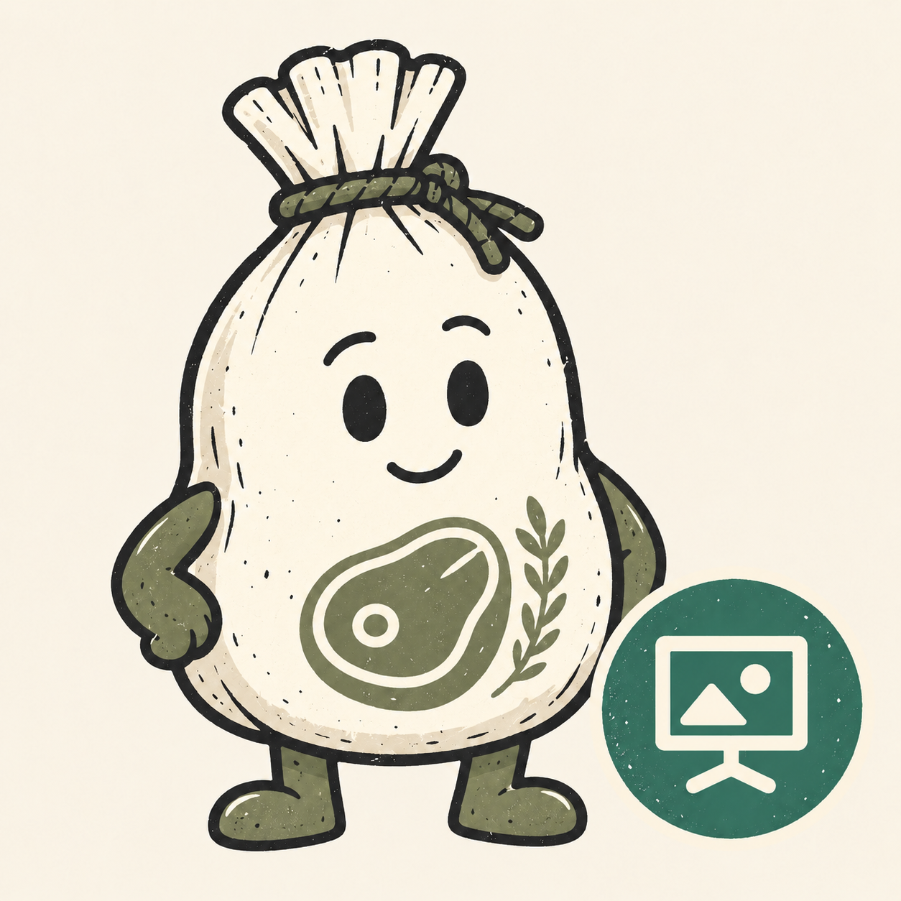
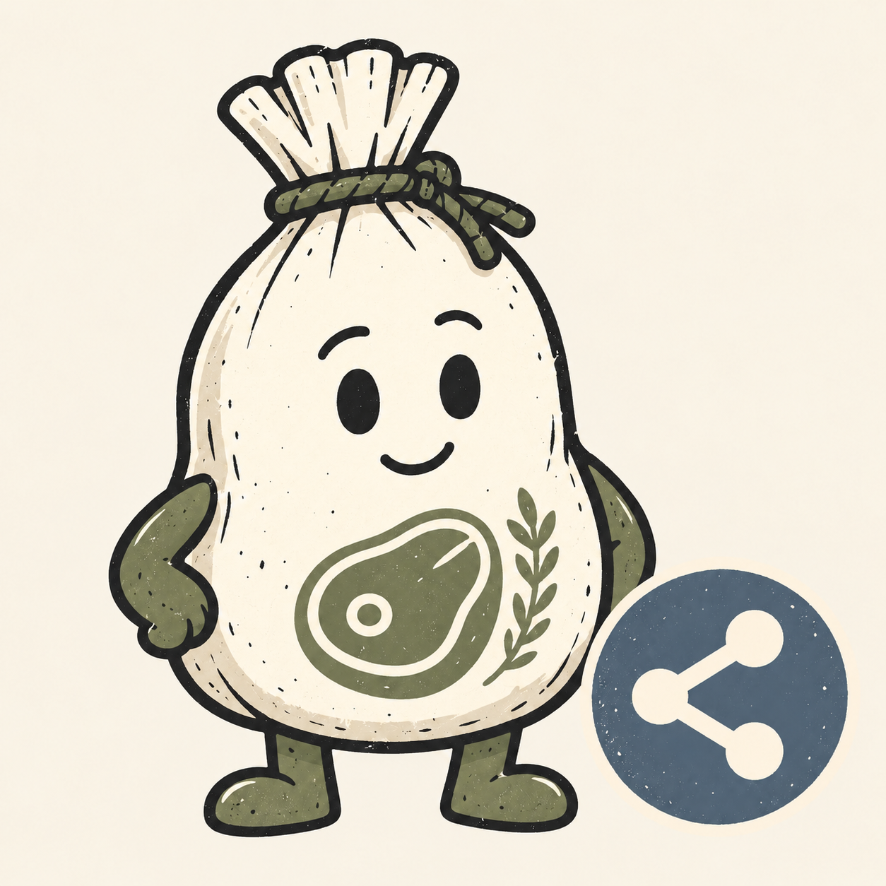

# Meatsack marketplace

Ask questions, publish pages, and share files with a person. One marketplace,
three independently installable plugins:

| Icon | Plugin | What it does | Product |
| --- | --- | --- | --- |
|  | `askmeatsack` | Ask a person questions and wait for answers | [askmeatsack.com](https://askmeatsack.com) |
|  | `showmeatsack` | Publish HTML, markdown, or a small static site | [showmeatsack.com](https://showmeatsack.com) |
|  | `sharemeatsack` | Send files to a person or request files from them | [sharemeatsack.com](https://sharemeatsack.com) |

The icons share the cream cloth Meatsack character with a bottom-right badge:
Ask uses a rust question mark, Show a green presentation screen, and Share a
slate share symbol. See [icon prompts and provenance](docs/icons.md).

Each package includes the hosted MCP connection, workflow skill, product logo,
and client listing metadata. No product app checkout, application dependencies,
API key, or local server is needed to use the hosted tools.

## Distribution

This marketplace packages the plugins from the three public product repositories.
The GitHub installation commands below add this marketplace to your client.
Each plugin is independently installable.

Adding this marketplace is separate from submitting plugins to the public
ChatGPT/Codex or Cursor directories. Those listings require their own review.

## Codex

```sh
codex plugin marketplace add garylesueur/meatsack-marketplace
```

Restart the desktop app, open Plugins, select the **Meatsack** source, and install
the products you need.
For local testing, use the marketplace directory path instead of the GitHub
shorthand above. This command adds the marketplace; it does not install or enable
all three plugins automatically.

See [OpenAI's marketplace documentation](https://developers.openai.com/plugins/build/plugins).

## Claude Code

```text
/plugin marketplace add garylesueur/meatsack-marketplace
/plugin install askmeatsack@meatsack
/plugin install showmeatsack@meatsack
/plugin install sharemeatsack@meatsack
```

Run only the install commands for the products you want. For local testing,
replace the GitHub shorthand with the absolute marketplace directory path.

See [Claude's marketplace documentation](https://code.claude.com/docs/en/plugin-marketplaces).

## Cursor

On Teams or Enterprise, open **Dashboard → Plugins & MCPs → Add Marketplace →
Import from Repo**, using `https://github.com/garylesueur/meatsack-marketplace`.
Install individual products from **Customize**.

For a local install on a personal account:

```sh
git clone https://github.com/garylesueur/meatsack-marketplace.git
mkdir -p ~/.cursor/plugins/local/askmeatsack
cp -R meatsack-marketplace/plugins/askmeatsack/. ~/.cursor/plugins/local/askmeatsack/
mkdir -p ~/.cursor/plugins/local/showmeatsack
cp -R meatsack-marketplace/plugins/showmeatsack/. ~/.cursor/plugins/local/showmeatsack/
mkdir -p ~/.cursor/plugins/local/sharemeatsack
cp -R meatsack-marketplace/plugins/sharemeatsack/. ~/.cursor/plugins/local/sharemeatsack/
```

Copy only the plugins you need, then restart Cursor or run Developer: Reload
Window. In Customize, confirm that each plugin’s skill and MCP server are
available. Local plugin imports must be allowed for your account or team.
Cursor skips local symlinks that point outside its plugin folder. For local
testing, copy from the existing `plugins/<product>` directories.

See [Cursor's installation documentation](https://prod.cursor.com/docs/plugins).

## Maintaining the packages

`plugins.json` is the explicit registry and file allowlist. Product repositories
own the manifests, MCP configuration, logos, and skills. Change them there, then
run:

```sh
npm run sync
npm run validate
claude plugin validate .
```

The sync fetches the configured source refs into a temporary directory and copies
only allowlisted files. It never runs product code. It rejects symlinks, unsafe
paths, mismatched identities, and mismatched versions before replacing output.
No application code, `.env` files, or dependency directories belong in a package.

For sibling local checkouts:

```sh
MEATSACK_SOURCE_ROOT=.. npm run sync
```

Clean source trees are required by default. While developing changes across the
product repos, preview them with:

```sh
MEATSACK_SOURCE_ROOT=.. npm run sync -- --allow-dirty
```

`plugins.lock.json` records the source commit and `localChanges` for each package.
A dirty preview is not a release from that commit. Before publishing, regenerate
from clean, published source refs and run `npm run validate -- --release` to
check that every `localChanges` is false.

Generated outputs are `plugins/`, `plugins.lock.json`, and the three client
marketplace catalogs. Do not edit them by hand. Product names remain `.com` in
user-facing copy and MCP tool names; plugin IDs omit `.com` for client compatibility.

The sync and validation scripts are adapted from
[Calmtech's marketplace](https://github.com/calmtechltd/calmtech-marketplace)
under the MIT license. See [LICENSE](LICENSE).
